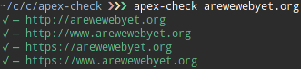
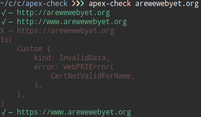
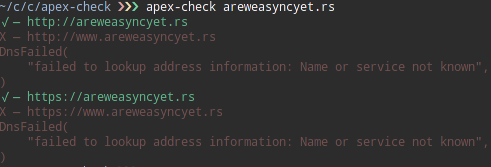

# apex-check

Extremely simple cli utility to check if the 4 simplest variations of a domain
give a non-error response. Useful for checking if a GitHub pages site with a
custom domain is accessible from the most common ways of typing in a domain.

## The GitHub Pages Solution

If you are using GitHub Pages and one of the `www` subdomain or the apex domain
is not working with HTTPS, [that is a known issue]. The best solution would be
to set a CNAME/ALIAS on the one that is not working to point to the main domain
version you are using. i.e. if the apex domain is not working, have a CNAME
record on the apex domain pointing towards the `www` subdomain

### Examples

Perfect:

---

Apex domain has invalid SSL:

---

No `www` subdomain set:

[that is a known issue]: https://github.com/isaacs/github/issues/1675
